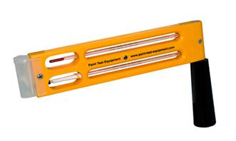

## Theory

Temperature and humidity of air determine the climatic condition of work environment. As the climatic condition becomes more hot and humid, the work efficiency of the workers reduces. More over workers may feel tired which may lead to accident occasionally, and in extreme cases fatality may occur due to heat stress. Hence determining the psychrometric properties of air which are related to heat and humidity condition is very important to assess the quality of work space environment. The following psychrometric properties are relevant for determining climatic conditions.

1. Dry-bulb temperature
2. Wet-bulb temperature
3. Saturated Vapour Pressure
4. Vapour Pressure
5. Relative Humidity
6. Specific Humidity
7. Mixing Ratio
8. Dew point temperature
9. Enthalpy

#### **Dry Bulb Temperature TD**
The dry-bulb temperature is the temperature of air measured by a thermometer freely exposed to the air but shielded from radiation and moisture. Dry bulb temperature is the temperature that is usually thought of as air temperature, and it is the true thermodynamic temperature. It is the temperature measured by a regular thermometer exposed to the airstream. The dry-bulb temperature is an indicator of heat content in the air.

#### **Wet Bulb Temperature TW**
This is the temperature recorded by a thermometer whose bulb is covered with a thin cotton gauge which is dipped at the lower end into water so that the surface of the bulb is kept moist by capillary action. If such a thermometer is placed in unsaturated air, the wet bulb of the thermometer will lose latent heat in the process of evaporation of moisture surrounded with the bulb. As a result, the temperature of the bulb will fall. Once the air is saturated, there will be no further evaporation and cooling of the thermometer then it will show a constant temperature. This temperature is called Wet bulb temperature TW. Thus, the wet bulb temperature TW, in conjunction with the dry bulb temperature TD, gives a measure of the degree of saturation or the Relative Humidity (RH) of air

#### **Whirling Hygrometer or Sling Psychrometer**
This instrument consists of a wet-bulb thermometer and a dry-bulb thermometer. These two thermometers are fastened on cork mounted in a wooden frame with arrangement for rotating the same to provide a relative movement of air around the thermometer bulbs. The two bulbs are placed in such a way that the evaporative cooling and moisture from wet-bulb do not affect the dry bulb. It is provided with a handle for whirling the instrument such that continuous rotation of the bulb causes the fresh air to pick up moisture surrounding the wet-bulb. The instrument is rotated at the rate of 20rad/s so that relative air velocity of 3m/s can be maintained. The least count of this instrument is 1°C
 
 
            
Figure 1: Whirling Hygrometer

          

#### **Assmann Psychrometer**
Assmann psychrometer is similar to whirling hygrometer by operational principle. However, two thermometers in this psychrometer are ventilated by a fan operated by a clock-type spring. The fan should be run for 3 minutes before taking a reading. Chromium-plated metal sleeves of the bulbs prevent radiation from surroundings. The least count of the Assmann psychrometer is 0.2°C. So, this instrument is five times more accurate than whirling hygrometer.

 
            
Figure 2: Assmann Psychrometer

          

#### **Fortin Barometer**
It is an instrument which works on mercury level measurement. It has a long glass tube, filled with mercury. The height of mercury column which indicates the pressure can be read from the scale on brass tube. As atmospheric pressure changes, the mercury level in the cistern changes accordingly. For example, an increase in atmospheric pressure causes the mercury level to rise. The mercury is contained within a flexible pouch and screw jack causing the level either to rise or fall. By moving the screw of vernier, the top of the column is matched with the lower edge of the vernier and the reading is then taken from main scale and vernier scale. The mercury is toxic; hence, direct contact should be avoided while using the instrument. When adjusting the mercury level to point zero, the adjusting screw should not be turned too quickly and if the mercury has been moved through a large amount, the instrument should be left to settle before making the final setting.

								
								
Figure 3: Fortin Barometer

#### Observation
The pressure inside the ventilation lab = 745.5 mm Hg.
Least count = 0.1 mm Hg.

#### **Aneroid Barometer**
An aneroid barometer uses a small, flexible metal box called an aneroid cell. This cell is made from an alloy of beryllium and copper. The evacuated capsule is presented from collapsing by a string spring. Small changes in the outside air cause the box to expand or contract. Small levers, present in the barometer amplify the small changes and cause the needle to show the pressure. The mechanism is made deliberately "stiff" so that, tapping the barometer reveals whether the barometer is rising or falling as the pointer moves.

								
								
Figure 4: Aneroid Barometer

#### Observation
The pressure obtained by the aneroid barometer = 742.2 mm Hg.
Least count = 0.1 mm Hg.

## Apparatus Used
1. Assmann Psychrometer
2. Fortin Barometer

## Demo

            <iframe width="560" height="315" src="http://www.youtube.com/embed/VQTzpdqK9Vs" frameborder="0" allowfullscreen></iframe>
          

